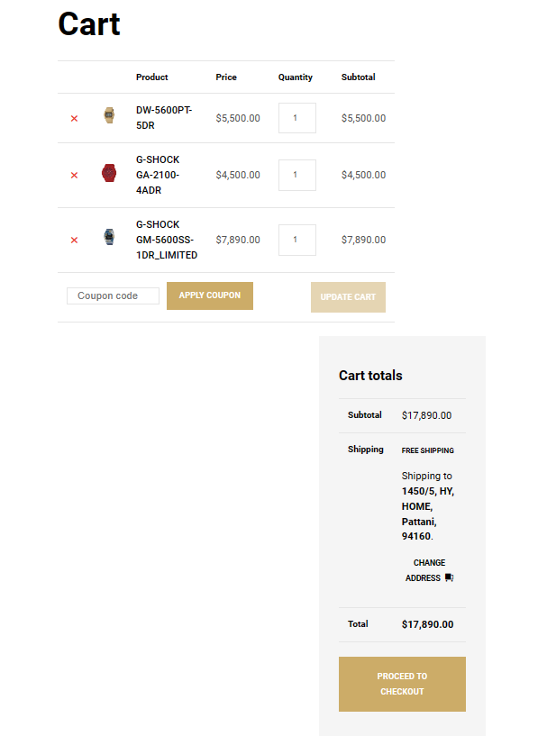

# Modern-Ecommerce-Platforms
Design and Develop Modern Ecommerce Plafform

# Project Overview
#### I chose to design a website selling authentic brand watches from Japan. We choose to sell G-shock brand watches, which is the brand with the highest sales in the world. We have many models of this brand. Our shop selects products to sell products that are durable, strong and sell well to sell here as well. We choose to design a website that is easy to use to make it easy for customers. Our products are designed using Wordpress, which is a very popular website creation platform these days. with simplicity It's not complicated to use and has many add-ons used for website development. The strong point that our shop chooses to use WordPress is that it is easy to create a website. Secure and upgrade your website frequently. There are many themes to choose from, and WordPress plugins offer a wide variety of tools and tools for working with websites. And it can be used in many languages. Wordpress is popular all over the world because it can be used in many languages. And in addition to this, there are also plug-ins created to support multilingual websites so that you can create a business as well. Wordpress can be created and sold to a wide variety of users. You can create and market your work with Wordpress.

#### The reason to use laragon is that it is a web server emulator. Laragon is fast and efficient for PHP, Node.js, Python, Java, Go, Ruby. It is fast, lightweight, easy to use, and easily extensible. Especially for building and managing modern web applications. Focus on efficiency Designed with stability in mind Simplicity, flexibility and freedom, so you'll find Laragon works quickly and smoothly.

# Steps to install Laragon
#### Click Next.
#### Select the installed storage location as desired.
#### Click Next >
#### Click Install.
#### The program is installing.
#### The installation program is finished. Press Finish.
#### Next will be installing wordpress.

# Steps to install WordPress on localhost (Laragon)
#### Step 1 : Download the latest version of WordPress onto your machine before wordpress.org
#### Step 2 : Copy all files/folders to laragon and give the folder a simple name for easy opening of wordpress on wep.
#### Step 3 : Press Start All.
#### Step 4 : Create a database / collation: utf8_general_ci and give the database a short name for filling in data in WordPress.
#### Step 5 : Press to Wep.
#### Step 6 : Bring up the Install WordPress page by pressing localhost/folder name/press enter, you will be prompted to fill in information.
#### Step 7: Login into WordPress and you're done.

### Visual Paradigm Visual Paradigm is a leading and globally recognized provider for Business and IT Transformation software solutions. It enables organizations to improve business and IT agility and foster innovation through popular open standards. Our award-winning products are trusted by over 320,000 users in companies ranging from small business, consultants, to blue chip organizations, universities and government units across the globe. About Visual Paradigm Visual Paradigm.

### First, we log into Wordpress. After that, it will come up at the back of the house for us to choose. But it didn't have much in it. Basically, whatever we want to do, we have to download it ourselves in Wordpress. After that, the first thing we have to do is create our website. in making website pages
### Wordpress gives us two options: 1. Design the website page yourself. 2. If you want to focus on convenience and speed, find a ready-made theme and edit it to make it your own. And I chose the second option, which was to find a theme to use, which I used the theme of LaVenta version 1.2 by Catch Themes for his website page. But his theme is a diamond selling website. Which will be similar to what we will use to make a website selling watches. We chose to customize the website and change the image. Change information It comes like a watch sales website. Next is we will add a plug-in. So what is a plug-in? Plugins are extensions to Wordpress in the form of scripts that improve performance. and expand the ability to make a normal website into a perfect website

# What plug-ins do you use?
- Woocommerce What is Woocommerce and what are its advantages? It is a plugin that can turn a simple WordPress website into an e-commerce website in just a few clicks. With a variety of abilities Sell many types of products Whether it is an ordinary product that can be tangible Digital file type products. WooCommerce can do everything a basic e-commerce website should have, such as a membership system, payments, shipping, warehouse management, and sales reporting system. and many other subsystems.
- PDF Invoices & Packing Slips for WooCommerce It will be a plugin to add a PDF invoice to send along with the order confirmation email that will be sent to the customer. Comes with templates and can also customize the appearance or create our own templates.
  
# Website overview
### HomePage

## Shoppage

## Cart

