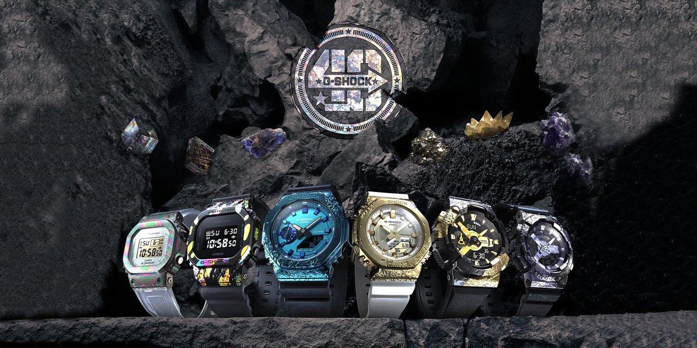

# Modern-Ecommerce-Platforms
Design and Develop Modern Ecommerce Plafform

# Project Overview
#### I chose to design a website selling authentic brand watches from Japan. We choose to sell G-shock brand watches, which is the brand with the highest sales in the world. We have many models of this brand. Our shop selects products to sell products that are durable, strong and sell well to sell here as well. We choose to design a website that is easy to use to make it easy for customers. Our products are designed using Wordpress, which is a very popular website creation platform these days. with simplicity It's not complicated to use and has many add-ons used for website development. The strong point that our shop chooses to use WordPress is that it is easy to create a website. Secure and upgrade your website frequently. There are many themes to choose from, and WordPress plugins offer a wide variety of tools and tools for working with websites. And it can be used in many languages. Wordpress is popular all over the world because it can be used in many languages. And in addition to this, there are also plug-ins created to support multilingual websites so that you can create a business as well. Wordpress can be created and sold to a wide variety of users. You can create and market your work with Wordpress.

- ยังไม่ทำครับ
