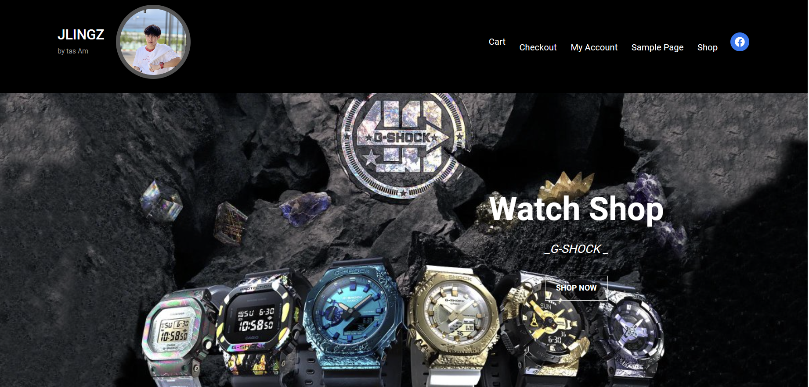
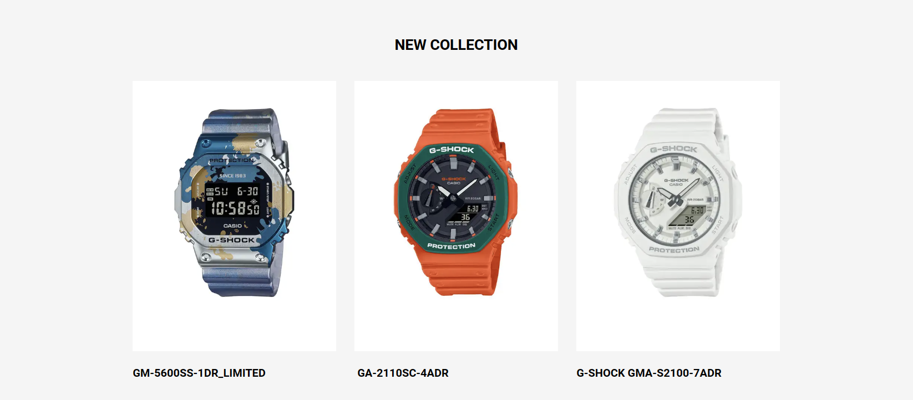

# Modern-Ecommerce-Platforms
Design and Develop Modern Ecommerce Plafform

# Abstract
 I chose to design a website selling authentic brand watches from Japan. We choose to sell G-shock brand watches, which is the brand with the highest sales in the world. We have many models of this brand. Our shop selects products to sell products that are durable, strong and sell well to sell here as well. We choose to design a website that is easy to use to make it easy for customers. Our products are designed using Wordpress, which is a very popular website creation platform these days. with simplicity It's not complicated to use and has many add-ons used for website development. The strong point that our shop chooses to use WordPress is that it is easy to create a website. Secure and upgrade your website frequently. There are many themes to choose from, and WordPress plugins offer a wide variety of tools and tools for working with websites. And it can be used in many languages. Wordpress is popular all over the world because it can be used in many languages. And in addition to this, there are also plug-ins created to support multilingual websites so that you can create a business as well. Wordpress can be created and sold to a wide variety of users. You can create and market your work with Wordpress.

# Software used
**Laragon** The reason to use laragon is that it is a web server emulator. Laragon is fast and efficient for PHP, Node.js, Python, Java, Go, Ruby. It is fast, lightweight, easy to use, and easily extensible. Especially for building and managing modern web applications. Focus on efficiency Designed with stability in mind Simplicity, flexibility and freedom, so you'll find Laragon works quickly and smoothly.
**Wordpress** At its core, WordPress is the simplest, most popular way to create your own website or blog. In fact, WordPress powers over 43.3% of all the websites on the Internet. Yes – more than one in four websites that you visit are likely powered by WordPress. What Is WordPress? Explained for Beginners
**Visual Paradigm** is a leading and globally recognized provider for Business and IT Transformation software solutions. It enables organizations to improve business and IT agility and foster innovation through popular open standards. Our award-winning products are trusted by over 320,000 users in companies ranging from small business, consultants, to blue chip organizations, universities and government units across the globe. About Visual Paradigm Visual Paradigm. 

First, we log into Wordpress. After that, it will come up at the back of the house for us to choose. But it didn't have much in it. Basically, whatever we want to do, we have to download it ourselves in Wordpress. After that, the first thing we have to do is create our website. in making website pages
 Wordpress gives us two options: 1. Design the website page yourself. 2. If you want to focus on convenience and speed, find a ready-made theme and edit it to make it your own. And I chose the second option, which was to find a theme to use, which I used the theme of LaVenta version 1.2 by Catch Themes for his website page. But his theme is a diamond selling website. Which will be similar to what we will use to make a website selling watches. We chose to customize the website and change the image. Change information It comes like a watch sales website. Next is we will add a plug-in. So what is a plug-in? Plugins are extensions to Wordpress in the form of scripts that improve performance. and expand the ability to make a normal website into a perfect website

#  plug-ins  use?
- Woocommerce What is Woocommerce and what are its advantages? It is a plugin that can turn a simple WordPress website into an e-commerce website in just a few clicks. With a variety of abilities Sell many types of products Whether it is an ordinary product that can be tangible Digital file type products. WooCommerce can do everything a basic e-commerce website should have, such as a membership system, payments, shipping, warehouse management, and sales reporting system. and many other subsystems.
- WooCommerce PDF Invoices & Packing Slips Thai Language Pack (Adds Thai font (Norasi) to WooCommerce PDF Invoices & Packing Slips)
- PDF Invoices & Packing Slips for WooCommerce It will be a plugin to add a PDF invoice to send along with the order confirmation email that will be sent to the customer. Comes with templates and can also customize the appearance or create our own templates.
- PeproDev WooCommerce Receipt Uploader Upload Receipt for Any Payment method in WooCommerce. Customers will Upload the receipt (image/pdf) and Shop Managers will approve/reject it manually.
- Chaty Chat with your website visitors via their favorite channels. Show a chat icon on the bottom of your site and communicate with your website visitors.
  
# Website overview
### HomePage

### Shoppage

### Cart

# BPMN Diagram

This BPMN diagram shows my ecommerce website process. It showcases key interactions and workflows that enhance the platform's user-friendly online JLingz shop experience.

### All Pools in BPMN
- Customer
- Website
- Admin
- Delivery

#### Customer pool

- Start with the green dot. It marks the beginning of the customer journey on the platform.
- Select Products: The customer selects the desired products from the available options.
 
- Add product to cart: After selecting the product step The customer checks in to the cart.
If the customer is satisfied with the selected product They will go through the payment process. If the customer still hesitates in choosing a product, the customer can cancel the product or go back and select it again.

 
- Checkout Process: The process to Checkout the product. (The customer fill their shipping detail.)
- **Fill the shipping detail** : The customer fill their shipping detail.
 
- Identify payment method: customer choose the payment method. In my wetsite have 2 ways are 2C2P, and Bank transfer.

- Payment Process: There are 2 methods to choose from. The first method is cash on delivery. The second method is a bank transfer. Customers can pay at their convenience. (Destination or bank transfer) for bank transfer Customers can send proof of transfer right away. We will have a place to send evidence to you. If the customer pays on delivery, the customer waits to pay when the driver comes to deliver the product.

# Website pool

- Receive orders from customers in order to wipe customer slips.
- Check slip and confirm order process: This process admin will check the slip of payment and confirm order. When checking the correctness of payment If correct, it will enter the stock checking process. If it is incorrect, the order will be canceled.
- Stock checking process: Admin will check stock. If there is enough product, it will proceed to the next step. (Prepare orders for delivery)

# Admin pool

- The next step will be preparing the customer's order. Pack the product well so that it is not damaged during the delivery.
- Customer order is ready to ship.
- Next, the order will be sent to the shipping company.

# Delivery pool 

- The shipping company receives orders from admins in order to deliver goods to customers.
- Next, the parcel number will be sent to the admin in order for the admin to send the parcel number to his customers.
- Next, the product will be sent to the customer in at least approximately 3 days (if we make payment on delivery, we can wait to pay for shipping).

#### Conclution
- JLingz  e-commerce website is a testament to the power of digital transformation in the world ofJLingz Shop. It combines the flexibility and user-friendly nature of WordPress and WooCommerce with careful customization and strategic plugin integration.
